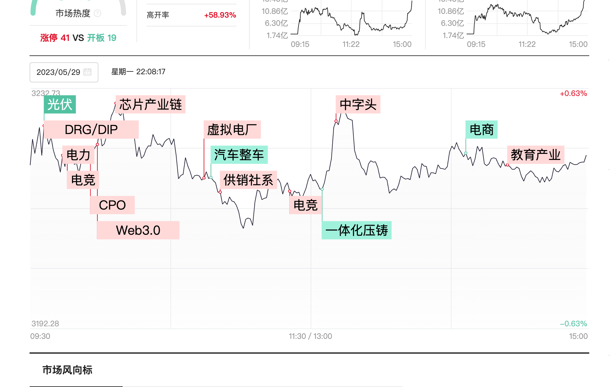

我是结合同花顺和[财联社](https://www.cls.cn/)来分析的

## 今天的买卖情况
卖出：柯力传感
买入：剑桥科技、游族网络、四川长虹

今天开盘将柯力传感卖了，水下卖的，原因是昨天预判机器人退潮期，老大丰立智能都没回拉，虽然睿能科技还是封板，但是我当时判定是因为吃了存储芯片概念涨停。

买入剑桥，是cpo概念，还是龙头，想着低吸。隔壁鸿博股份涨停了吃的应该是英伟达的红利。反正养家老师在剑桥也有个3个亿，还没出货，不怕不怕。

买入四川长虹，完全是因为周末c919商业飞机首飞概念，因为上周五脑机接口的几个相关股票都涨了（脑机接口成交额为88亿，所以占上证的成交额权重很小，不像中特估），所以就想着四川长虹也会涨停。但现在想想如果要涨停的话，一开始就会直接直线拉升的，震荡很久说明该消息并没有影响该股。

买入游族网络，是因为中午游戏大部分都在涨，并且看到顺网科技也直接涨停，并且游族网络以前是个龙头，并且看k线占上了k线，有跃跃上升的趋势。套牢盘也并不多。但是后续游戏也回落了。现在想想顺网科技涨的原因是因为英伟达。

以前持有的：漫步者还没卖掉，这个是因为我因为把柯力传感买飞了，导致想万一把漫步者也买飞了就难受了。这个下次可以看看整个板块来决定。
## 分析
1. 盘面分析：
    上证指数虽然稳住了，但是深圳指数和创业版指跌了，上证指数拉升是由于中特估拉升导致，因为中特估就占了上证1/5的权重。所以实际上上证来看，市场其实是低迷的，明天大概率也不乐观。
2. 方向和轮动
    
    cpo拉了一波，看剑桥科技就能知道
    AI电商也拉升了一波，但是回落了，可以看看以前龙头焦点科技。
    传媒：拉升最后也回落了，可以看看浙版传媒炸板了。
    游戏： 中午还利好，原因是一个消息，英伟达将人工智能引入游戏，首席执行官在会上展示将npc角色对话的过程。但是不知道为什么游族网络后续直接快跌停。
    https://www.cls.cn/detail/1363153
    电力：老大哥杭州热点虽然不太行了，但是老二接上了，桂东电力直接涨停。这个我预判不了，就没买。
3. 

## 闲暇之余刷到的

北大博士也亏了 https://v.douyin.com/Um45Bn6/ 

    